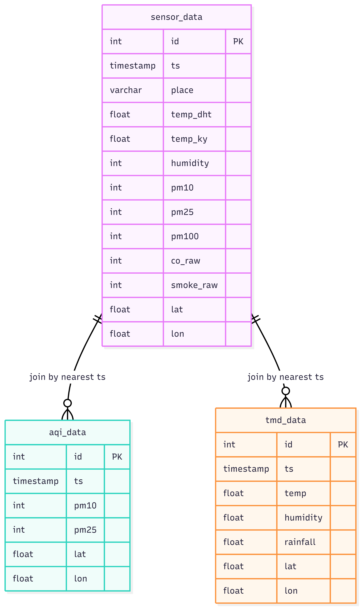

# SAM — Smart Air Measure

Air quality dashboard + PM2.5 AQI prediction project using a Next.js frontend and FastAPI backend.

This README is aligned with what the codebase currently implements.

## Team members

- 6710545733 Phruek Chantarasittiphon
- 6710545784 Paranyu Kittinavakit

**Affiliation:** Department of Computer Engineering, Faculty of Engineering, Kasetsart University (Software and Knowledge Engineering).

## Video Presentation

For DAQ:
https://youtu.be/uo7WXr30O-Y

For DA:
https://youtu.be/KYs1_O15RE4

## What Is Implemented Now

- AQI proxy via AQICN (`/api/aqi`) with 10-minute in-memory cache
- Weather proxy via Open-Meteo (`/api/weather`) with 15-minute in-memory cache
- IP-based geolocation via ip-api (`/api/location`) with 1-hour cache
- MySQL connectivity status + `sensor_data` row count (`/api/dashboard/stats`)
- Sensor ingestion pipeline: KidBright -> MQTT -> Node-RED -> MySQL
- PM2.5 AQI prediction endpoint (`/api/predict`) returning both:
  - Random Forest prediction (`pm25_aqi_rf`)
  - Linear Regression prediction (`pm25_aqi_mlr`)
- Latest sensor-feature fetch for prediction (`/api/predict/latest`)
- Nearest actual AQI lookup by timestamp from DB (`/api/predict/actual`)

## Current Frontend Pages

- `/` : Landing page
- `/features` :
  - Detects location from backend `/api/location`
  - Shows current AQI + pollutant details from AQICN
  - Shows current weather + 7-day weather forecast from Open-Meteo
  - Shows 7-day PM2.5 forecast (from AQICN daily forecast payload)
- `/dashboard` :
  - Shows DB connection status and total `sensor_data` record count
  - Includes placeholder cards/panels (not a full live sensor chart dashboard)
- `/predict` :
  - Loads latest sensor row (or backend defaults if DB unavailable)
  - Supports manual editing of features
  - Calls prediction API and displays RF vs MLR outputs + nearest actual AQI
  - Displays static analysis images served from backend `/static` and frontend `/public`

## Architecture

```text
browser  ->  frontend (Next.js)  ->  backend (FastAPI)  ->  external APIs
                                |                        (AQICN, Open-Meteo, ip-api)
                                ->  MySQL (optional)

KidBright boards  ->  MQTT broker  ->  Node-RED flow  ->  MySQL tables
```

## Sensor Data Pipeline (KidBright -> MQTT -> Node-RED -> MySQL)

Data ingestion from physical sensors is handled outside the FastAPI app:

1. KidBright boards publish sensor payloads to MQTT topics.
2. Node-RED subscribes to MQTT topics, transforms payloads, and writes SQL INSERT statements.
3. Node-RED stores records in MySQL tables (for example `sensor_data`, `aqi_data`, `tmd_data`).
4. FastAPI reads from MySQL for dashboard status and prediction-related endpoints.

Related files:

- `node-red.json`
- `kidbright/board1.py`
- `kidbright/board2.py`
- `kidbright/config.py`

## Sensors Used

- **Digital Temperature Sensor (KY-028)** - measures temperature
- **Temperature and Humidity Sensor (KY-015)** - measures humidity
- **CO Sensor (MQ-9)** - detects carbon monoxide concentration
- **Dust Sensor (PMS7003)** - measures particulate matter such as PM2.5

## Requirements

- Node.js 18+
- npm 9+
- Python 3.11+
- MySQL 8+ (optional)

## Setup

### 1) Model Files and Charts

The prediction route attempts to load:

- `backend/models/rf_model.pkl`
- `backend/models/mlr_model.pkl`

Windows:

```bash
cd analysis
pip install scikit-learn joblib pandas
python save_model.py
```

macOS:

```bash
cd analysis
python3 -m pip install scikit-learn joblib pandas
python3 save_model.py
```

Current `analysis/save_model.py` behavior:

- trains RF + MLR on `analysis/output/integrated_air_quality_data.csv`
- saves both model `.pkl` files into `backend/models/`
- copies:
  - `feature_importance.png`
  - `model_comparison.png`
    into `backend/static/`

Also used by `/predict` page if present:

- `backend/static/residual_predicted_vs_actual.png`
- `backend/static/residual_error_distribution.png`
- `frontend/public/sensor-graph-*.png`

### 2) Backend

Windows:

```bash
cd backend
pip install -r requirements.txt
cp .env.example .env
python -m uvicorn main:app --reload
```

macOS:

```bash
cd backend
python3 -m venv .venv
source .venv/bin/activate
pip install -r requirements.txt
cp .env.example .env
python3 -m uvicorn main:app --reload
```

Backend `.env` keys:

```env
DB_HOST=localhost
DB_PORT=3306
DB_USER=root
DB_PASSWORD=your_password
DB_NAME=your_name
AQICN_TOKEN=your_token
```

Notes:

- If MySQL is down or not configured, the API still starts.
- `/api/dashboard/stats` will return `connected: false` in that case.

### 3) Frontend

Windows and macOS: same commands

```bash
cd frontend
npm install
cp .env.example .env.local
npm run dev
```

Frontend `.env.local`:

```env
NEXT_PUBLIC_API_URL=http://localhost:8000
```

## 📊 Database Schema

The system integrates data from sensors, weather APIs, and historical AQI records.


SQL schema files used in this project:

- `database_schema/aqi_data.sql`
- `database_schema/sensor_data.sql`
- `database_schema/tmd_data.sql`

If you want to use data from https://iot.cpe.ku.ac.th/pma/. Use b6710545784 account

## API Endpoints

- `GET /` : Health message + docs path
- `GET /api/aqi?lat=...&lng=...` : AQICN proxy
- `GET /api/weather?lat=...&lon=...&timezone=...` : Open-Meteo proxy
- `GET /api/location` : IP geolocation
- `GET /api/dashboard/stats` : DB status + `sensor_data` count
- `GET /api/predict/latest` : latest sensor row mapped to model features + nearest actual AQI
- `GET /api/predict/actual?ts=...` : nearest actual AQI for timestamp
- `POST /api/predict` : predict PM2.5 AQI (RF + MLR)

FastAPI docs: http://localhost:8000/docs

## Tech Stack

Backend:

- FastAPI
- SQLAlchemy + PyMySQL
- httpx
- cachetools
- scikit-learn + joblib

Frontend:

- Next.js 16 (App Router) + TypeScript
- React 19
- CSS

## Project Structure

```text
SAM-Smart-Air-Measure-DAQ/
├── analysis/
│   ├── save_model.py
│   └── output/
├── database_schema/
│   ├── aqi_data.sql
│   ├── sensor_data.sql
│   └── tmd_data.sql
├── backend/
│   ├── main.py
│   ├── database.py
│   ├── requirements.txt
│   ├── .env.example
│   ├── models/              # generated .pkl files
│   ├── static/              # generated/served charts
│   └── routers/
├── frontend/
│   ├── src/app/
│   │   ├── page.tsx
│   │   ├── features/page.tsx
│   │   ├── dashboard/page.tsx
│   │   └── predict/page.tsx
│   ├── public/
│   ├── .env.example
│   └── package.json
└── kidbright/
```

## Link to GitHub repository

https://github.com/ParanyuLion/SAM-Smart-Air-Measure-DAQ
